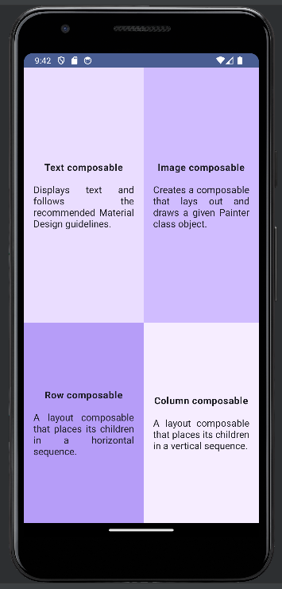

# Compose Quadrant App

## Description
This is a simple Kotlin app to display information about some Composable functions.

## Using the App

- You require Android studio IDE to run the app. The app can be accessed with the android studio emulator
or on a physical device via USB or WIFI debugging.

## Installing the APP

- Clone this repo to local environment.

        git@github.com:ntwigamartin/Compose_quadrant_app.git
- Start Android Studio, open existing project and select this project on the location you had cloned it.
- Run the app via the virtual android atudio emulator or physical device via usb debugging.

## Author

- Martin Ntwiga.
